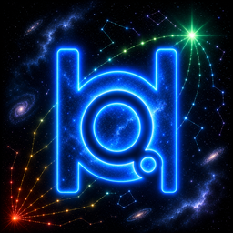
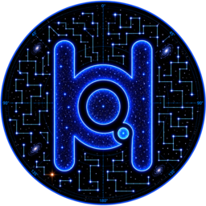
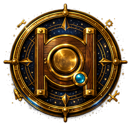
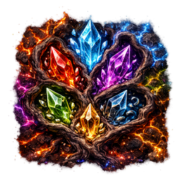

# HyperQuant Media LLP

**Engineering services & product studio — games, tools, and AI-native dev systems.**

---

## 👋 Who we are

A small, senior studio out of India building **games, developer tools, and AI-native development systems**. We ship our own products and take on engineering-services work — engine-level, tooling, and AI-agent infrastructure.

We run as an **Adaptive Studio**: leadership is earned, not owned; quality is the only motor.

## 🛠️ What we build

- **🎮 Games** — original titles and reusable game systems.
- **🧰 Developer tools** — AI-native systems that make building faster and saner.
- **🤝 Engineering services** — studio-grade delivery for partners, under contract.

## 🚀 Selected public work

### [Kingshot-Island-Architect](https://hyperquantmedia.github.io/Kingshot-Island-Architect/)
A quick community side-tool for **Oasis island-stitching** in the game [Kingshot](https://www.centurygames.com/games/kingshot/).

> Most of our product and client work is **private** (see *Access & confidentiality* below).

## 🌌 Under the Celestial Forge

🌌 *Somewhere off the charted trail, we stack **Cairns** — cooking cosmic, celestial stars from stone, signal, and patience. The constellation isn't lit yet.*

*The studio's private constellations. Most of what we forge stays dark a while — a glimpse of the light, never the map.*

<b><i>Watch the sky.</i></b>

<table>
<tr>
<td align="center" width="118"> <b>Polaris</b></td>
<td><i>A fixed light in a moving sky. We steer by it; we don't explain it.</i></td>
</tr>
<tr>
<td align="center"> <b>Cairn</b></td>
<td><i>Stones set toward what we can't see yet.</i></td>
</tr>
<tr>
<td align="center"> <b>DocuTale</b></td>
<td><i>It lifts the fog — over what, we won't yet say.</i></td>
</tr>
<tr>
<td align="center"> <b>Quartermaster</b></td>
<td><i>Something keeps the count in the dark. Ask no more.</i></td>
</tr>
<tr>
<td align="center"> <b>Veins of Nexus</b></td>
<td><i>Beneath the stone, a red heart beats. We have not woken it yet.</i></td>
</tr>
</table>

## 🧱 Tech

**Engines**

  
  
  

**Platforms**

  
  
  
  
  
  

**Graphics APIs**

  
  
  
  
  
  

**Languages**

  
  
  
  
  
  
  
  
  
  
  
  
  
  

**Profiling & GPU tooling**

  
  
  
  
  
  
  

**Tools**

  
  
  
  
  
  
  
  

**AI**

  
  
  
  
  
  

**Version control**

  
  
  

**CI/CD**

  
  
  

---

## 🔒 Access & confidentiality

Most HyperQuant Media repositories are **private**. Access is granted **under NDA**, with
IP and copyright assignment; trademarks pending. **Accepting access to any HQM repository
automatically binds you to our repository-access NDA.**

To request access or a copy of the agreement: **[bizdev@hyperquantmedia.com](mailto:bizdev@hyperquantmedia.com)**.

---

© 2026 HyperQuant Media LLP · India · All rights reserved.

